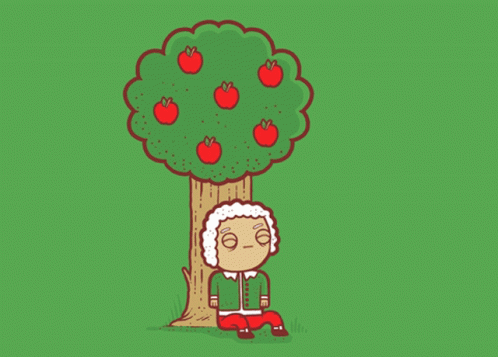

# Flipbook_language
By Mooizz <br/>
It took me total of 3 hours to understand,decide which language and libraries to use and finally develop the compiler.
Libraries Used : PIL <br/>
fc.py is the compiler <br />
Default without any arguments other than the file to be compiled, It creates an pdf of the defined flipbook. <br />
```
01 05 child.jpg
06 10 adolescent.jpg
11 15 young-adulthood.jpg
16 20 adulthood.jpg
21 25 old-age.jpg

```
To Create Pdfs
```
./fc.py life.flip
```
```
./fc.py life.flip -pdf
```
```
./fc.py life.flip -pdf images.pdf
```
To Creates Gifs
```
./fc.py life.flip -gif
```
```
./fc.py life.flip -gif lifecycle.gif
```


```
01 03 newton1.jpg
04 06 newton2.jpg
07 09 newton3.jpg
10 12 newton4.jpg
13 15 newton5.jpg
16 18 newton6.jpg
19 21 newton7.jpg
22 24 newton8.jpg
25 27 newton9.jpg
28 30 newton10.jpg
31 33 newton11.jpg
34 36 newton12.jpg
37 39 newton13.jpg
40 42 newton14.jpg
43 45 newton15.jpg
46 48 newton16.jpg
```
```
./fc.py newton.flip -gif newtons.gif
```

